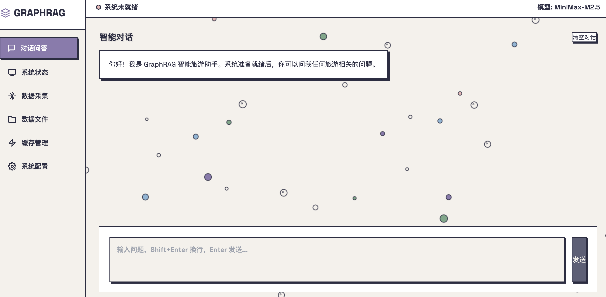
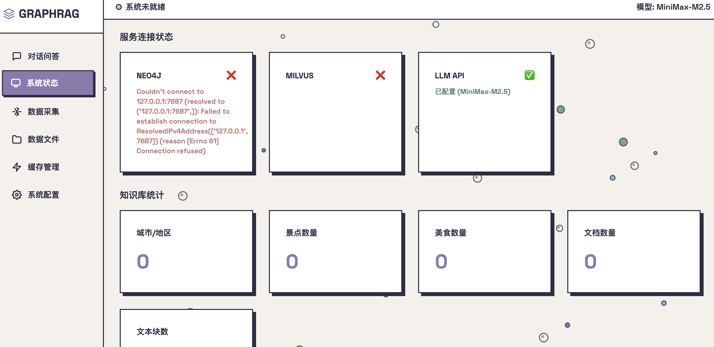

# GraphRAG

> 智能图RAG旅游助手 - 基于 Neo4j 图数据库与向量检索的智能问答系统

[](https://www.python.org/)
[](LICENSE)
[]()
[]()
[]()

## v2.0 新版本预告

> 全新设计的 Web UI，更现代的界面、更流畅的交互体验

**智能对话界面**



**系统状态监控**



## 核心特性

- **图 RAG 检索** - 基于 Neo4j 的多跳遍历与图结构推理
- **向量检索** - Milvus + BGE 中文嵌入模型高效搜索
- **智能路由** - LLM 驱动的查询策略自动选择
- **混合检索** - 传统检索与图 RAG 的 Round-robin 融合
- **现代 Web UI** - 基于 FastAPI + 现代前端的美观 Web 界面
- **数据采集系统** - 自动化的多源旅游数据采集与处理
- **缓存管理** - 智能缓存机制提升响应速度

## 快速开始

### 环境要求
- Python 3.12+（目前使用3.12.7）
- Docker (用于 Neo4j 和 Milvus)
- Node.js 18+ (用于 ToolBbrowser 数据采集)
- 16GB+ 内存

### 第三方依赖

本项目数据采集功能依赖以下两个开源项目，**作为 git submodule 自动集成**。

详细许可信息请参见 [THIRD_PARTY_NOTICE.md](THIRD_PARTY_NOTICE.md)。

| 工具 | 用途 | 项目地址 | 许可证 |
|------|------|----------|--------|
| **ToolBbrowser** | 浏览器自动化数据采集 | [epiral/bb-browser](https://github.com/epiral/bb-browser) | 参见原项目 |
| **Scrapling** | Python 爬虫框架 | [D4Vinci/Scrapling](https://github.com/D4Vinci/Scrapling) | 参见原项目 |

#### 安装第三方采集工具

**使用安装脚本（推荐）**

```bash
# 自动安装所有第三方工具及其依赖
./setup-tools.sh
```

**手动安装**

如果安装脚本无法使用，可以手动初始化 submodule 并安装：

```bash
# 1. 初始化并更新 git submodule
git submodule update --init --recursive

# 2. 安装 ToolBbrowser
cd ToolBbrowser
pnpm install
pnpm build
cd ..

# 3. 安装 Scrapling
cd Scrapling-main
pip install -e .
cd ..
```

### 安装与启动

```bash
# 1. 克隆项目 (使用 --recursive 拉取 submodule)
git clone --recursive https://github.com/Zzeng0917/Rag_python.git
cd Rag_python

# 如果已经克隆但没有使用 --recursive，可以手动初始化:
# git submodule update --init --recursive

# 2. 创建虚拟环境
conda create -n rag_graph python=3.12.7
conda activate rag_graph

# 3. 启动 Docker 服务
docker-compose up -d --build

# 4. 安装依赖
pip install -r requirement.txt

# 5. 配置环境变量 (.env 文件)
NEO4J_URI=bolt://127.0.0.1:7687
NEO4J_PASSWORD=your-password
LLM_MODEL=your_model
LLM_API_KEY=your_api_key
LLM_BASE_URL=your_base_url
```

### 启动方式

**方式一：Web UI（推荐）**

```bash
# 进入项目目录
cd rag_graph

# 启动 Web 服务
python main.py web

# 或使用 uvicorn
uvicorn web.app:create_app --reload --port 8000
```

访问 http://localhost:8000 打开 Web 界面

**方式二：命令行界面**

```bash
# 进入项目目录
cd rag_graph

# 启动交互式 CLI
python main.py

# 单次查询模式
python main.py query "北京有哪些必去的景点？"

# 系统健康检查
python main.py doctor

# 查看所有命令
python main.py --help
```

## 使用指南

### Web 界面功能

Web 界面提供以下功能模块：

| 模块 | 功能描述 |
|------|----------|
| **对话问答** | 智能旅游问答，支持上下文对话 |
| **系统状态** | 实时监控 Neo4j、Milvus、LLM 服务状态 |
| **数据采集** | 触发和管理多源数据采集任务 |
| **数据文件** | 查看和管理采集的原始数据文件 |
| **缓存管理** | 查看缓存统计和清理缓存 |
| **系统配置** | 动态调整系统参数和模型配置 |

### CLI 交互式命令

在 CLI 交互模式中可使用以下命令：
- `/help` - 显示帮助信息
- `/stats` - 查看系统统计
- `/quit` 或 `/exit` - 退出系统

### 快捷键
- `Ctrl+C` (连续两次): 退出系统
- `Shift+Enter`: 输入框换行
- `Enter`: 发送消息

## 项目结构

```
Rag_python/
├── config/                    # 配置文件目录
│   ├── config.py              # 主配置管理
│   ├── .env                   # 环境变量
│   ├── .env.example           # 环境变量示例
│   └── docker-compose.yml     # Docker 编排
│
├── rag_graph/                 # 主程序目录
│   ├── main.py                # 程序入口
│   ├── cli.py                 # CLI 界面 (Typer + Rich)
│   ├── requirement.txt        # 依赖列表
│   │
│   ├── rag_modules/           # 核心 RAG 模块
│   │   ├── graph_data_preparation.py    # 图数据准备
│   │   ├── graph_rag_retrieval.py       # 图 RAG 检索
│   │   ├── hybrid_retrieval.py          # 混合检索
│   │   ├── intelligent_query_router.py  # 智能路由
│   │   ├── milvus_index_construction.py # 向量索引
│   │   ├── generation_integration.py    # 生成集成
│   │   └── graph_indexing.py            # 图索引构建
│   │
│   ├── web/                   # Web UI 服务
│   │   ├── app.py             # FastAPI 应用入口
│   │   ├── routers/           # API 路由
│   │   │   ├── system.py      # 系统状态 API
│   │   │   ├── chat.py        # 对话 API
│   │   │   ├── collect.py     # 数据采集 API
│   │   │   ├── cache.py       # 缓存管理 API
│   │   │   └── data.py        # 数据文件 API
│   │   └── static/            # 前端静态文件
│   │
│   ├── collectors/            # 数据采集系统
│   │   ├── processor.py       # 数据处理主入口
│   │   ├── core/              # 采集核心模块
│   │   ├── adapters/          # 数据源适配器
│   │   └── tasks/             # 采集任务定义
│   │
│   ├── ui/                    # CLI 界面组件
│   ├── utils/                 # 通用工具函数
│   └── cache/                 # 缓存数据
│
├── docs/                      # 文档和图片
│   ├── image1.png             # 界面预览图
│   └── image2.png             # 系统状态图
│
├── data/                      # 数据目录
│
# 第三方采集工具 (通过 git submodule 集成)
├── ToolBbrowser/              # [epiral/bb-browser](https://github.com/epiral/bb-browser)
├── Scrapling-main/            # [D4Vinci/Scrapling](https://github.com/D4Vinci/Scrapling)
├── .gitmodules.example        # git submodule 配置示例
│
└── setup-tools.sh             # 第三方工具自动化安装脚本
```

## 核心配置

系统配置通过 `config/.env` 文件管理：

```bash
# Neo4j 图数据库
NEO4J_URI=bolt://127.0.0.1:7687
NEO4J_USER=neo4j
NEO4J_PASSWORD=your-password

# Milvus 向量数据库
MILVUS_HOST=127.0.0.1
MILVUS_PORT=19530
MILVUS_COLLECTION_NAME=travel_knowledge

# 大语言模型
LLM_MODEL=your_model
LLM_API_KEY=your_api_key
LLM_BASE_URL=your_base_url

# 嵌入模型 (中文优化)
EMBEDDING_MODEL=BAAI/bge-small-zh-v1.5

# 检索配置
TOP_K=5
MAX_GRAPH_DEPTH=2
TEMPERATURE=0.1
```

复制 `config/.env.example` 到 `config/.env` 并修改为你的配置：

```bash
cp config/.env.example config/.env
# 编辑 config/.env 填入你的配置
```

## 技术栈

- **数据库**: Neo4j (图), Milvus (向量), MinIO (对象存储)
- **AI/ML**: BGE 中文嵌入, LangChain, OpenAI API
- **Web 框架**: FastAPI + 现代前端
- **CLI 框架**: Typer + Rich
- **核心语言**: Python 3.12+

## RAG 分享

> 记录发现的 RAG 相关有用内容

### 2025 年 11 月

| 日期 | 内容 | 标签 |
|:----:|------|:----:|
| **11/30** | [**字节跳动 RAG 实践手册**](https://docs.qq.com/doc/DSXJiaE5taUtaVGx6) <br> 字节内部 RAG 系统架构设计，涵盖数据处理、索引构建、检索优化、生成层设计等完整实践经验 | `工业实践` `架构设计` |

---

## 致谢

### 开源项目
- [BAAI](https://github.com/FlagOpen/FlagEmbedding) - 优秀的 BGE 嵌入模型
- [Neo4j](https://neo4j.com/) - 强大的图数据库
- [Milvus](https://milvus.io/) - 高性能向量数据库
- [Datawhale](https://github.com/datawhalechina/all-in-rag) - RAG 学习教程
- [Hugging Face](https://huggingface.co/) - 丰富的预训练模型资源

### 数据采集工具
- [ToolBbrowser](https://github.com/epiral/bb-browser) - 浏览器自动化数据采集 (by @epiral)
- [Scrapling](https://github.com/D4Vinci/Scrapling) - Python 爬虫框架 (by @D4Vinci)

## 联系我

- **项目主页**: [https://github.com/Zzeng0917/Rag_python](https://github.com/Zzeng0917/Rag_python)
- **问题反馈**: [Issues](https://github.com/Zzeng0917/Rag_python/issues)
- **功能建议**: [Discussions](https://github.com/Zzeng0917/Rag_python/discussions)
- **邮箱**: zxd450273@gmail.com

---

<div align="center">

**如果这个项目对你有帮助，请给我们一个 Star！**

Made with by RAG Python Team

</div>
