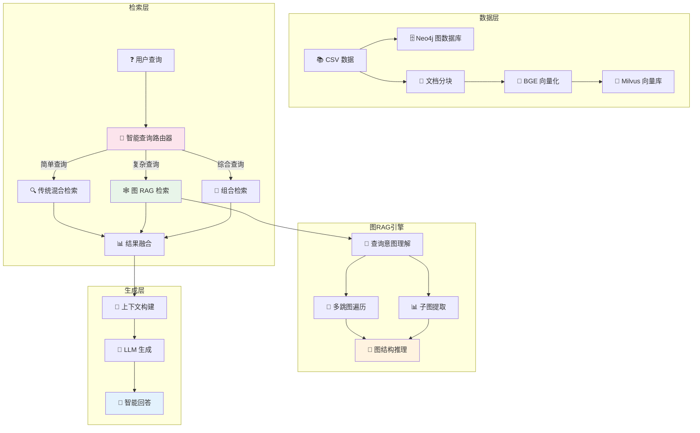
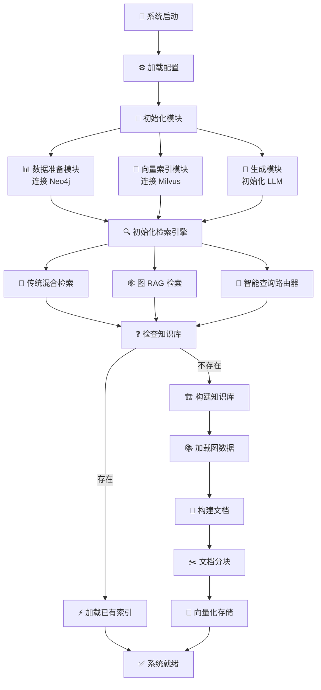
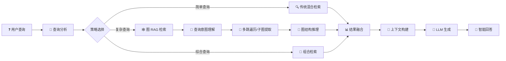

**注意：以下写好了大体的框架，但是具体使用还在开发中**

**教程来自：https://github.com/datawhalechina/all-in-rag**

# 🚀 RAG Python

> 一个基于 Python 的高性能检索增强生成 (RAG) 系统，集成 **图数据库**、**向量检索** 与 **智能路由** 技术

[](https://www.python.org/)
[](LICENSE)
[]()
[]()
[]()
[]()

## 📋 目录

- [✨ 特性](#-特性)
- [🏗️ 系统架构](#️-系统架构)
- [🚀 快速开始](#-快速开始)
- [📁 项目结构](#-项目结构)
- [⚙️ 配置说明](#️-配置说明)
- [🔄 工作流程](#-工作流程)
- [🛠️ 技术栈](#️-技术栈)
- [📖 使用指南](#-使用指南)
- [📰 每日 RAG 分享](#-每日-rag-分享)
- [🤝 贡献](#-贡献)

## ✨ 特性

### 🎯 核心功能

| 功能 | 描述 |
|------|------|
| 🕸️ **图 RAG 检索** | 基于 Neo4j 图数据库的多跳遍历、子图提取、图结构推理 |
| ⚡ **向量检索** | 基于 Milvus + BGE 嵌入模型的高效向量相似度搜索 |
| 🧠 **智能查询路由** | LLM 驱动的查询分析，自动选择最佳检索策略 |
| 🔄 **混合检索** | 传统检索 + 图 RAG 结合，Round-robin 策略融合结果 |
| 💾 **持久化存储** | 索引缓存机制，支持瞬间启动 |
| 📝 **结构化分块** | 按标题智能分块，建立文档父子关系 |

### 🕸️ 图 RAG 特性

- **🔍 查询意图理解**: 从自然语言到图查询的智能转换
- **🔗 多跳图遍历**: 深度关系探索，发现隐含知识关联
- **📊 子图提取**: 获取实体相关的完整知识网络
- **🧩 图结构推理**: 地理位置、景点关联、美食文化等多维度推理
- **🎯 自适应查询规划**: 根据复杂度动态调整遍历策略

### 🚦 智能路由能力

<table>
<tr>
<td width="50%">

**📊 查询分析维度**

| 维度 | 范围 |
|:-----|:-----|
| 复杂度 | `0` 简单查找 → `1` 复杂推理 |
| 关系密集度 | `0` 单一实体 → `1` 关系网络 |
| 推理需求 | 多跳 / 因果 / 对比分析 |

</td>
<td width="50%">

**🎯 路由策略选择**

| 策略 | 适用场景 |
|:-----|:---------|
| 🔍 `hybrid_traditional` | 简单直接的信息查找 |
| 🕸️ `graph_rag` | 复杂关系推理和知识发现 |
| 🔄 `combined` | 两种策略结合，取长补短 |

</td>
</tr>
</table>

## 🏗️ 系统架构



## 🚀 快速开始

### 📦 环境要求

- **Python**: 3.12+
- **Docker**: 用于运行 Neo4j 和 Milvus
- **内存**: 建议 16GB+
- **存储**: 根据数据规模调整

### 🔧 安装步骤

1. **克隆项目**
   ```bash
   git clone https://github.com/Zzeng0917/Rag_python.git
   cd Rag_python
   ```

2. **启动基础服务**
   ```bash
   cd rag_graph
   docker-compose up -d
   ```

3. **安装依赖**
   ```bash
   pip install -r requirement.txt
   ```

4. **配置环境变量**
   ```bash
   # 创建 .env 文件
   cat > .env << EOF
   # Neo4j 配置
   NEO4J_URI=neo4j://127.0.0.1:7687
   NEO4J_USER=neo4j
   NEO4J_PASSWORD=your_password
   NEO4J_DATABASE=neo4j

   # Milvus 配置
   MILVUS_HOST=localhost
   MILVUS_PORT=19530
   MILVUS_COLLECTION_NAME=travel_knowledge

   # LLM 配置
   LLM_MODEL=your_model
   LLM_API_KEY=your_api_key
   LLM_BASE_URL=your_base_url

   # 模型配置
   EMBEDDING_MODEL=BAAI/bge-small-zh-v1.5
   EOF
   ```

5. **导入图数据**
   ```bash
   # 在 Neo4j Browser 中执行 neo4j_data/import_data.cypher
   ```

6. **启动系统**
   ```bash
   python main.py
   ```

## 📁 项目结构

```
Rag_python/
├── rag/                           # 📚 基础 RAG 系统
│   ├── config.py                  # 配置管理
│   ├── main.py                    # 主程序入口
│   ├── requirements.txt           # 依赖列表
│   ├── rag_modules/               # 核心模块
│   │   ├── data_preparation.py    # 数据准备
│   │   ├── index_construction.py  # 索引构建
│   │   ├── retrieval_optimization.py  # 检索优化
│   │   └── generation_integration.py  # 生成集成
│   └── vector_index/              # 向量索引缓存
│
├── rag_graph/                     # 🕸️ 图 RAG 系统 (核心)
│   ├── config.py                  # 图 RAG 配置
│   ├── main.py                    # 主程序入口
│   ├── requirement.txt            # 依赖列表
│   ├── docker-compose.yml         # Docker 编排
│   ├── rag_modules/               # 核心模块
│   │   ├── graph_data_preparation.py    # 图数据准备
│   │   ├── graph_rag_retrieval.py       # 🕸️ 图 RAG 检索
│   │   ├── hybrid_retrieval.py          # 🔄 混合检索
│   │   ├── intelligent_query_touter.py  # 🧠 智能路由
│   │   ├── milvus_index_construction.py # 向量索引
│   │   ├── graph_indexing.py            # 图索引
│   │   └── generation_integration.py    # 生成集成
│   ├── neo4j_data/                # Neo4j 数据文件
│   │   ├── cities.csv             # 城市数据
│   │   ├── attractions.csv        # 景点数据
│   │   ├── foods.csv              # 美食数据
│   │   ├── hotels.csv             # 酒店数据
│   │   ├── restaurants.csv        # 餐厅数据
│   │   ├── relationships.csv      # 关系数据
│   │   └── import_data.cypher     # 导入脚本
│   └── volumes/                   # Docker 数据卷
│       ├── milvus/
│       └── minio/
│
└── README.md                      # 项目文档
```

## ⚙️ 配置说明

### 🎛️ 图 RAG 配置

```python
@dataclass
class GraphRAGConfig:
    # Neo4j 图数据库配置
    neo4j_uri: str = "neo4j://127.0.0.1:7687"
    neo4j_user: str = "neo4j"
    neo4j_password: str = ""
    neo4j_database: str = "neo4j"

    # Milvus 向量数据库配置
    milvus_host: str = "localhost"
    milvus_port: int = 19530
    milvus_collection_name: str = "travel_knowledge"
    milvus_dimension: int = 512  # BGE-small-zh-v1.5 维度

    # 模型配置
    embedding_model: str = "BAAI/bge-small-zh-v1.5"
    llm_model: str = ""

    # 检索配置
    top_k: int = 5
    max_graph_depth: int = 2  # 图遍历最大深度

    # 生成配置
    temperature: float = 0.1
    max_tokens: int = 2048

    # 分块配置
    chunk_size: int = 500
    chunk_overlap: int = 50
```

### 🌍 环境变量

```bash
# .env
NEO4J_URI=neo4j://127.0.0.1:7687
NEO4J_USER=neo4j
NEO4J_PASSWORD=your_password

MILVUS_HOST=localhost
MILVUS_PORT=19530

LLM_MODEL=your_model
LLM_API_KEY=your_api_key
LLM_BASE_URL=your_base_url

EMBEDDING_MODEL=BAAI/bge-small-zh-v1.5
HF_ENDPOINT=https://hf-mirror.com
```

## 🔄 工作流程

### 📊 系统启动流程



### 🎯 查询处理流程



## 🛠️ 技术栈

### 🗄️ 数据库技术
| 技术 | 用途 |
|------|------|
| **Neo4j** | 图数据库，存储知识图谱和实体关系 |
| **Milvus** | 向量数据库，高效相似度搜索 |
| **MinIO** | 对象存储，Milvus 数据持久化 |
| **etcd** | 元数据存储，Milvus 配置管理 |

### 🧠 AI/ML 技术
| 技术 | 用途 |
|------|------|
| **BGE (bge-small-zh-v1.5)** | 中文向量嵌入模型 |
| **LangChain** | LLM 应用开发框架 |
| **OpenAI API** | 大语言模型接口 |

### 🐍 核心框架
| 技术 | 用途 |
|------|------|
| **Python 3.12+** | 主要开发语言 |
| **python-dotenv** | 环境变量管理 |
| **dataclasses** | 配置数据类 |

## 📖 使用指南

### 📖 基础使用

```python
from config import DEFAULT_CONFIG
from main import AdvancedGraphRAGSystem

# 创建系统实例
rag_system = AdvancedGraphRAGSystem(config=DEFAULT_CONFIG)

# 初始化系统
rag_system.initialize_system()

# 构建知识库
rag_system.build_knowledge_base()

# 智能问答
result, analysis = rag_system.ask_question_with_routing(
    "北京有哪些必去的景点？推荐一下附近的美食",
    stream=True,
    explain_routing=True
)
```

### 🔧 交互模式

```bash
python main.py

# 系统命令
# > stats    - 查看系统统计
# > rebuild  - 重建知识库
# > quit     - 退出系统

# 示例查询
# > 故宫附近有什么好吃的？
# > 北京一日游路线推荐
# > 为什么西藏旅游最佳季节是7-9月？
```

### 📊 查询示例

| 查询类型 | 示例 | 路由策略 |
|----------|------|----------|
| 简单信息 | "故宫的门票多少钱？" | `hybrid_traditional` |
| 实体关系 | "故宫附近有什么好吃的？" | `graph_rag` |
| 复杂推理 | "北京一日游，包括景点、美食和住宿" | `combined` |

---

## 📰  RAG 分享

> 📌 记录发现的 RAG 相关有用内容

### 🗓️ 2025 年 11 月

| 日期 | 内容 | 标签 |
|:----:|------|:----:|
| **11/30** | 📘 [**字节跳动 RAG 实践手册**](https://docs.qq.com/doc/DSXJiaE5taUtaVGx6) <br> 字节内部 RAG 系统架构设计，涵盖数据处理、索引构建、检索优化、生成层设计等完整实践经验 | `工业实践` `架构设计` |

---

## 🙏 致谢

- [BAAI](https://github.com/FlagOpen/FlagEmbedding) - 优秀的 BGE 嵌入模型
- [Neo4j](https://neo4j.com/) - 强大的图数据库
- [Milvus](https://milvus.io/) - 高性能向量数据库
- [Datawhale](https://github.com/datawhalechina/all-in-rag) - RAG 学习教程
- [Hugging Face](https://huggingface.co/) - 丰富的预训练模型资源

## 📞 联系我

- **项目主页**: [https://github.com/Zzeng0917/Rag_python](https://github.com/Zzeng0917/Rag_python)
- **问题反馈**: [Issues](https://github.com/Zzeng0917/Rag_python/issues)
- **功能建议**: [Discussions](https://github.com/Zzeng0917/Rag_python/discussions)
- **邮箱**: zxd450273@gmail.com

---

<div align="center">

**⭐ 如果这个项目对你有帮助，请给我们一个 Star！**

Made with ❤️ by RAG Python Team

</div>
